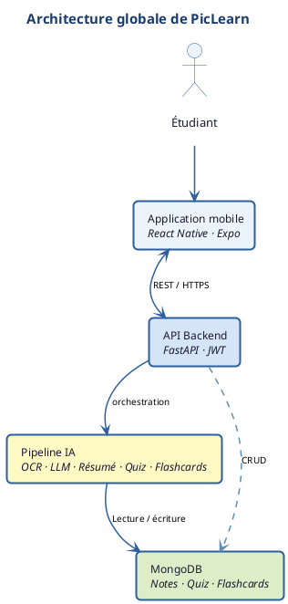

<div align="center">


### Turn photographed lecture notes into summaries, quizzes and flashcards with AI

[](#academic-context)
[](https://github.com/azddine123/aaca-project/graphs/contributors/)
[](https://github.com/azddine123/aaca-project/issues/)
[](https://github.com/azddine123/aaca-project/pulls/)
[](https://github.com/azddine123/aaca-project/actions/workflows/ci.yml)

[](https://github.com/azddine123/aaca-project/watchers/)
[](https://github.com/azddine123/aaca-project/network/)
[](https://github.com/azddine123/aaca-project/stargazers/)

</div>

---

# PicLearn — AI-Powered Academic Cognitive Assistant

**PicLearn** helps students turn their lecture notes — snapped on the fly or imported as PDF — into active learning resources: structured summaries, graded quizzes, spaced-repetition flashcards, and targeted Q&A on the course content.

The pipeline combines OCR, LaTeX formula extraction, automatic subject classification, LLM-based content generation (OpenAI / Google / Anthropic) and semantic search (RAG) to deliver a personalized revision experience, on mobile (iOS/Android) and web.

## 🌱 Getting Started

The project has two independent parts:

- **`backend/`** — FastAPI API (Python 3.13) hosting the whole AI pipeline
- **`frontend/`** — Expo / React Native mobile app

Each has its own setup guide below. You can run the backend alone (with the [interactive docs](http://localhost:8000/docs)) to test the API, or both together for the full experience.

## 🧰 What You Need

To run the code of this project, you'll need:

- **Python 3.13** and **Node.js 20+**
- **MongoDB 7** (local, or via `docker compose up -d`)
- At least **one LLM API key** among:
  - [OpenAI API](https://platform.openai.com/api-keys)
  - [Google AI (Gemini)](https://aistudio.google.com/apikey)
  - [Anthropic (Claude)](https://console.anthropic.com/)
- Basic knowledge of Python and/or TypeScript is helpful if you want to contribute

### Backend

```bash
cd backend
python3 -m venv venv && source venv/bin/activate
pip install -r requirements.txt

cp .env.example .env   # set SECRET_KEY + at least one LLM key

uvicorn app.main:app --reload --port 8000
# Interactive docs (if DEBUG=true): http://localhost:8000/docs
```

### Frontend

```bash
cd frontend
npm install
cp .env.example .env   # point to the backend API URL

npm run start           # then choose iOS / Android / Web
```

Full environment variable reference: [backend/.env.example](backend/.env.example).

## 📱 App Preview

<div align="center">

</div>

*Login → Home (sessions, active subjects) → Scan a course → Structured note with formulas → Revision (adaptive quiz, SM-2 flashcards).*

## 🏗️ Architecture

<div align="center">

</div>

```
Image/PDF → Preprocessing → OCR (+ Vision fallback if confidence is low)
          → LaTeX extraction → Subject classification
          → Content structuring → RAG indexing (ChromaDB)
          → Summary / quiz / flashcard generation
```

## 🗃️ Modules

| # | **Module** | **Description** | **Key Files** |
| --- | --- | --- | --- |
| 01 | **Authentication** | Sign-up, JWT login (access/refresh), email verification and OTP password reset | [`app/api/routers/auth.py`](backend/app/api/routers/auth.py) |
| 02 | **Capture & AI Pipeline** | Orchestrates image → OCR → LaTeX → classification → structured content | [`app/services/pipeline.py`](backend/app/services/pipeline.py) |
| 03 | **Multi-engine OCR** | PaddleOCR / EasyOCR with OpenAI Vision fallback below the confidence threshold | [`app/services/ocr_service.py`](backend/app/services/ocr_service.py) |
| 04 | **LLM Generation** | Summaries, quizzes, flashcards — multi-provider (OpenAI/Google/Anthropic) | [`app/services/llm_service.py`](backend/app/services/llm_service.py) |
| 05 | **RAG & Semantic Search** | Embeddings + ChromaDB to answer questions about a note | [`app/services/rag_service.py`](backend/app/services/rag_service.py) |
| 06 | **Notes & Multi-capture Sessions** | Note CRUD, merging several pages into one course | [`app/api/routers/notes.py`](backend/app/api/routers/notes.py), [`sessions.py`](backend/app/api/routers/sessions.py) |
| 07 | **Adaptive Learning** | Spaced repetition (SM-2), weak-point analysis, recommendations | [`app/services/adaptive_learning.py`](backend/app/services/adaptive_learning.py) |
| 08 | **Privacy & GDPR** | Full export and deletion of user data | [`app/services/gdpr_service.py`](backend/app/services/gdpr_service.py) |
| 09 | **Premium Payments** | Monthly free quota, paywall, RevenueCat webhook | [`app/services/payments_service.py`](backend/app/services/payments_service.py) |

## 📊 Field Validation

The need behind PicLearn was validated with **254 students** (ENSA Béni Mellal and other institutions, engineering/bachelor's/master's levels) on their note-capture, organization and revision habits, before the solution was designed.

## ✅ Tests & CI

```bash
cd backend
source venv/bin/activate
python -m pytest -q
```

The GitHub Actions CI ([`.github/workflows/ci.yml`](.github/workflows/ci.yml)) runs the backend pytest suite and the frontend TypeScript type-check on every push/PR to `main`.

## 🔐 Security & Privacy

- Security headers and strict CORS by default (no `*` in production)
- JWT tokens with revocation, rate limiting on sensitive routes
- Upload validation (magic bytes) and path-traversal protection
- Dedicated GDPR endpoints: full export and deletion of user data (Mongo + local files + RAG index)

## 🌟 Acknowledgments

Built by **Azddine El Hamdaoui** and **Youssef Ait Karroum**, supervised by **Pr. Ayoub Esswidi**.

Thanks to the defense committee: Pr. Bahaa Eddine Elbaghazaoui (President) and Pr. Hamza Touil (Examiner).

## 🎓 Academic Context

> Capstone defense project — *Project-Based Learning* module
> **Track:** Cybersecurity and Artificial Intelligence, 2nd year Engineering Cycle
> **École Nationale des Sciences Appliquées — Béni Mellal**, Université Sultan Moulay Slimane
> **Academic year:** 2025-2026

## 🙏 Contributing / Reporting an Issue

Found a bug or have a suggestion? [Open an issue](https://github.com/azddine123/aaca-project/issues) or [submit a pull request](https://github.com/azddine123/aaca-project/pulls).
